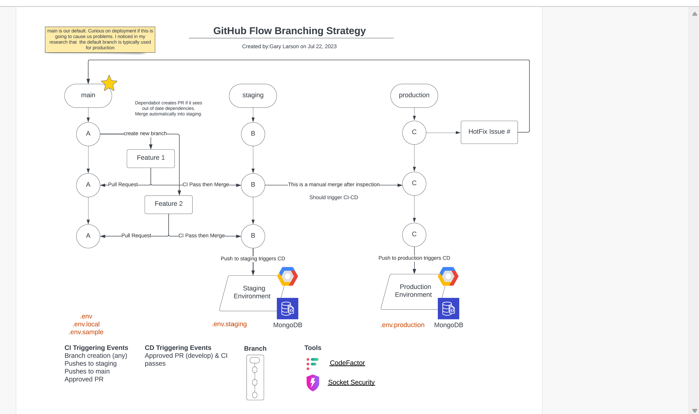

Welcome to the Pelletier Construction Group wiki!
Development
This section outlines the development environment and practices.

https://github.com/SeattleColleges/PelletierConstructionGroup.github.io/wiki/User-Story-&-Issue-Naming-Conventions
https://github.com/SeattleColleges/PelletierConstructionGroup.github.io/wiki/Development
https://github.com/SeattleColleges/PelletierConstructionGroup.github.io/wiki/Push-Pull-Request-Guidelines

Purpose
The repository hosts a NestJS application designed to manage clothing products (often referred to as products) for Belinda's Closet a student resource at North Seattle College for finding clothing for interviews.

Modules
Product Module: Manages all product-related functionalities.
User Module: Handles user data and interactions.
Auth Module: Responsible for authentication and authorization, ensuring secure access to resources.
Technologies
Built using NestJS, the application leverages TypeScript and follows RESTful API principles.

Collaboration
The repository is open for contributions and aims to be a collaborative effort among students and faculty.

